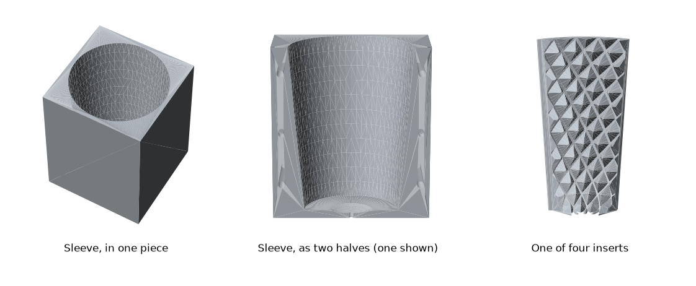
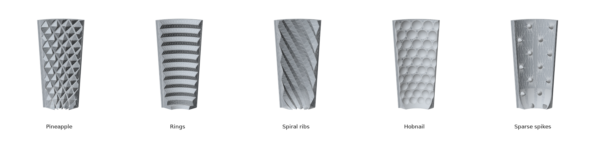
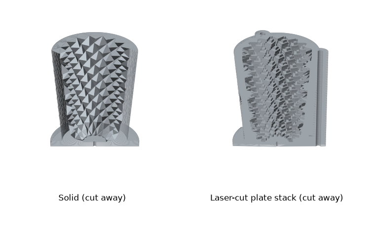
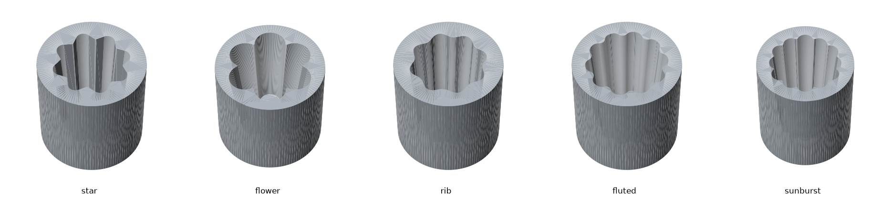
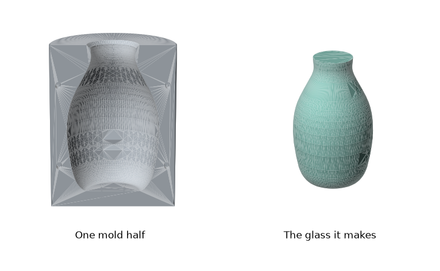
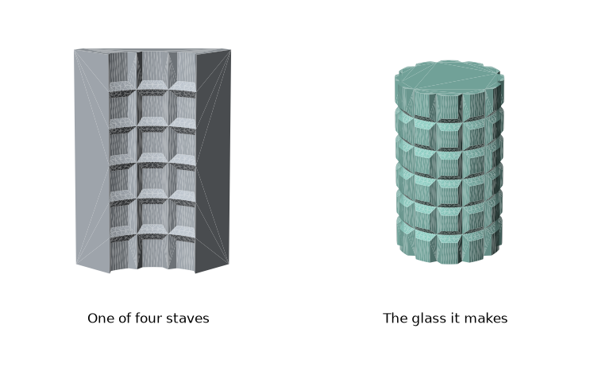

# Glassblowing mold generators

Parametric molds for hot glass, written as [build123d](https://github.com/gumyr/build123d) scripts. Each script writes ready-to-order files: STEP for a machine shop, DXF for a laser-cutting service, and STL for a look or a test print. The generated files are checked in under [`mold-designs/`](mold-designs/), so you can order parts without running anything.

> [!WARNING]
> **These are designs, not proven tools.** As far as this repository records, none of them has yet been made and used with glass. The scripts check that the parts are valid solids, fit together, and can be reached by a cutter, but nobody has confirmed how they behave at the bench. Treat the sizes as a starting point, and please report back if you build one.

## What is here

| Mold | What it does | How it is made | Script | Files |
|---|---|---|---|---|
| [Insert mold](#insert-mold) | Dip or blow mold with five swappable patterns on loose inserts | CNC milling | `pineapple_mold_generator.py` | `mold-designs/insert-mold/` |
| [Pineapple mold](#pineapple-mold) | One-piece version of the pineapple pattern | Laser-cut plates, or casting | `pineapple_mold_generator.py` | `mold-designs/pineapple/` |
| [Optic molds](#optic-molds) | Classic open dip molds: star, flower, rib, fluted, sunburst | CNC milling | `optic_mold_generator.py` | `mold-designs/optic/` |
| [Blow mold](#blow-mold) | Two-part mold for a vessel shape you draw as a profile | CNC milling | `blow_mold_generator.py` | `mold-designs/blow/` |
| [Segmented grenade mold](#segmented-grenade-mold) | Blow mold of four staves in a square tube, for a grid of raised squares | CNC milling plus stock tube | `segmented_mold_generator.py` | `mold-designs/segmented/` |

## Quick start

The only thing to install is [uv](https://docs.astral.sh/uv/). Each script declares its own dependencies and runs through its shebang:

```sh
./pineapple_mold_generator.py     # about two minutes
./optic_mold_generator.py         # every pattern
./optic_mold_generator.py star rib   # only these
./blow_mold_generator.py
./segmented_mold_generator.py
```

There is also a [just](https://just.systems/) file, so you don't have to remember the script names:

```sh
just                 # list the recipes
just all             # whatever is out of date: the molds, then the README pictures
just pineapple       # one generator: optic, blow, pineapple or segmented
just optic star rib  # only these optic patterns
just previews        # the README pictures
just force=true all  # everything, whether it is out of date or not
```

A generator is skipped when its files are newer than its script. Right after a fresh clone the file times mean nothing, so use `force=true` if you want to be sure.

- **Changing a design:** every script starts with a block of named settings in millimetres, each with a comment. Edit them and run the script again.
- **The report:** each run prints the sizes, weights, stock to buy, and the results of its checks. Read it before ordering; it warns when a setting makes a part that can't be machined or assembled.
- **Viewer:** the scripts finish by sending the parts to the [OCP CAD Viewer](https://github.com/bernhard-42/vscode-ocp-cad-viewer) for VS Code. Without the viewer running they print a connection error at the very end. The files are already written by then, so it can be ignored.
- **Pictures:** `./render_previews.py` redraws the images in this README from the generated STL files. `just all` does this after the molds.

## Insert mold



The pattern is not cut into the mold body. It is on four identical loose inserts, each a quarter of the wall, that drop into a sleeve with a tapered bore.

- **Snug but removable:** the inserts wedge into the taper under their own weight with no play, and are free the moment they lift. Hot inserts that have grown sit a little higher instead of jamming.
- **Nothing gets stuck:** if the glass chills and grabs the pattern, pulling it out brings the inserts with it, and they pull off sideways.
- **Registered seams:** a small step down each seam laps every insert over its neighbor, so none can drop inward, yet each still pulls straight off.
- **Curved bottom:** the wall curves in like a bowl and the pattern carries on round it, so the rounded end of a bubble meets the same pattern as its sides. The sleeve's floor is dished and vented so the glass can't seal to it.
- **Swappable:** all five insert sets fit the same sleeve.

### Insert sets



| Set | File | Pattern | In the glass | Cutter directions |
|---|---|---|---|---|
| Pineapple | `inserts/pineapple.step` | 14 rows of 16 diamond pyramids with small flat tips, about 3 to 9 mm deep, leaning into a spiral | A grid of dimples; gather over them to trap bubbles | 3 |
| Rings | `inserts/rings.step` | 11 V-shaped rings, 12 mm apart and 5 mm deep | Grooves round the piece | 2 |
| Spiral ribs | `inserts/spiral.step` | 16 ribs turning 120° from floor to rim | A swirl optic without twisting by hand | 2 |
| Hobnail | `inserts/hobnail.step` | 160 round pockets, 9 to 12.7 mm across; those on a seam are half in each insert | Rows of raised beads; blow into the mold to fill them | 2 |
| Sparse spikes | `inserts/spikes.step` | 56 cones, 7 mm tall | A few deep pits, for deliberate air-trap bubbles | 4 |

Make four of whichever set you want. "Cutter directions" is how many angles the cutter has to come from to reach the whole pattern: square-on to the insert's inside face, then turned to each side or tipped toward the floor. On a machine with a rotary axis these are index positions in one setup; on a plain 3-axis mill each is a separate tilted setup. The script works this out by line of sight and prints the share of the surface reached.

Rings and spiral ribs hold the glass against a straight pull, so expect those inserts to come out with the glass. Pineapple and spikes rely on the glass touching only the tips.

### Parts to order

| Part | Quantity | File | Stock | Notes |
|---|---|---|---|---|
| Insert | 4 of one set | `inserts/<set>.step` | about 65 × 37 × 122 mm each | The outside is the taper seat |
| Sleeve, one piece | 1 | `sleeve_solid.step` | 100 × 100 × 130 mm block | Bore is milled 126 mm deep from the top |
| Foot plate | 1 | `foot_plate_solid.dxf` | 130 × 130 × 8 mm plate | Sticks out 15 mm to stand on |
| M5 screws | 4 | | | Foot plate to the underside of the sleeve; countersink them |

The sleeve is also drawn as two halves, to quote against the one-piece version. Use one or the other:

| Part | Quantity | File | Stock | Notes |
|---|---|---|---|---|
| Sleeve half | 2 | `sleeve_half_a.step`, `sleeve_half_b.step` | 116 × 50 × 130 mm block each | Each half-bore is a trough 46 mm deep |
| Foot plate | 1 | `foot_plate_halves.dxf` | 146 × 130 × 8 mm plate | |
| M5 bolts and nuts | 4 | | at least 110 mm long | Through the split |
| Dowel pins | 2 | | 4 mm | Line the halves up |
| M5 screws | 4 | | | Foot plate |

Things to tell the shop:

- **Material:** 6061 aluminum machines cleanly and is the default. See [Materials](#materials).
- **Outside of the sleeve:** leave it as sawn. Only the bore, the floor and the holes matter.
- **Creases:** the sharp inside creases of every pattern may be left rounded to the cutter's radius. The glass never reaches them.
- **The files are true CAD surfaces, not converted meshes.** Walls are real cones, pockets real spheres, and rib flanks smooth curved surfaces. On the pineapple insert each point is a flat-sided boss with a flat tip, standing on the smooth wall with a strip of bare wall round it. Upload the `.step` files; the `.stl` files are meshes and a shop will reject them.
- **The taper:** the bore and the backs of the inserts are the same cone, 5.1° a side. An error of 0.1 mm in a diameter only moves the inserts 0.6 mm up or down, and they are designed to stand 1.5 mm clear of the floor to absorb it.
- **Split sleeve only:** the two half-bores must meet without a step.

### Size

| | |
|---|---|
| Cavity at the rim | 82 mm |
| Flat floor | 32 mm |
| Cavity depth | 124 mm |
| Opening between pineapple tips | 25 mm at the bottom, 63 mm at the rim |
| Sleeve | 100 mm square, 130 mm tall |

The main settings are `MOLD_DIAMETER`, `MOLD_HEIGHT`, `BOTTOM_RADIUS`, `FLOOR_RADIUS` and `BOWL_HEIGHT`. Each insert set has its own block of settings below those.

## Pineapple mold



The same pineapple cavity as the insert set, as a one-piece mold with a tapered body and a foot. It is drawn two ways.

**Laser-cut plate stack.** The cavity is sliced into flat plates that stack on threaded rods. The points come out stepped, and overhangs cost nothing because every plate is cut on its own.

| Part | Quantity | File | Notes |
|---|---|---|---|
| Plates | 41 | `plates/plate_01.dxf` to `plate_41.dxf` | 3.175 mm (1/8") sheet, up to 113 mm across, numbered from the bottom |
| M6 threaded rod | 3 | | at least 150 mm long, with nuts |

- **Order and alignment:** the rod holes are unevenly spaced, so a plate only fits one way round and one way up. Each plate also has a notch in its rim, a little further round than the one below, so a correctly ordered stack shows one diagonal line of notches.
- **Cost drivers:** 0.47 m² of sheet and 30 m of cut. The script prints these so you can compare variations.
- **Check before ordering:** the 6.4 mm rod holes and the 3.2 mm vent against your service's minimum hole size for the sheet you choose.

**Solid.** `solid.step` is one piece with true pyramids, for casting or metal printing. It cannot be milled: the points overhang, so a cutter working from above can't reach under them.

## Optic molds



One-piece open dip molds. The gather is pushed in to take the pattern and pulled straight out, so every cavity widens toward the top with at least 3° of draft.

| Pattern | Cavity | Bar stock |
|---|---|---|
| `star` | 67 → 82 mm, 100 mm deep | 4.5" round × 118 mm |
| `flower` | 74 → 103 mm, 100 mm deep | 5" round × 118 mm |
| `rib` | 69 → 82 mm, 100 mm deep | 4.5" round × 118 mm |
| `fluted` | 68 → 87 mm, 100 mm deep | 4.5" round × 118 mm |
| `sunburst` | 58 → 77 mm, 100 mm deep | 4" round × 118 mm |

The script is built around machining cost. It rounds the pocket corners to suit the cutter you name in `TOOL_DIAMETER`, picks the smallest standard bar that leaves enough wall, and reports the largest cutter that can finish each shape and how far it has to reach.

## Blow mold



A two-part mold for a vessel. You describe the outside of the finished piece as a list of (radius, height) points in `PROFILE`, and the script fits a smooth curve through them, scales it for shrinkage, and splits the block into two halves with dowel holes and vents.

## Segmented grenade mold



A blow mold for a grid of raised squares. Four identical staves stand in a length of square steel tube. The glass is blown out against them, and lifting the pipe brings the staves up with it so they fall away sideways. Each stave is machined square-on from its inside face.

| Part | Quantity | File | Notes |
|---|---|---|---|
| Stave | 4 | `stave.step` | from 71 × 20 × 100 mm bar |
| Square steel tube | 1 | | 3.5" × 3/16" wall, 100 mm long |
| Base plate | 1 | `base_plate.dxf` | 119 mm square, 6.35 mm; weld or bracket it to the tube |

The tube's real inside size and corner radius vary by supplier. Measure yours and adjust `TUBE_OUTER`, `TUBE_WALL` and `CORNER_RELIEF` before cutting staves.

## Materials

- **6061 aluminum:** the default for machined parts. It works even though it melts below glass working temperature, because contact is brief and aluminum carries the heat away quickly.
- **5052 aluminum:** fine for laser-cut plates, where it is a common sheet alloy. It is gummier to machine, so prefer 6061 for inserts and sleeves.
- **Mild steel:** a good choice for laser-cut plates and for anything with thin points, which stay harder when hot.
- **Never galvanized steel.** It gives off zinc fumes at glass temperatures.

Aluminum loses its hardness once it has spent time well above 200 °C, so points and edges get easier to dent with use.

## Using the molds

- **Keep contact short.** Don't let hot glass sit in a metal mold, and let the mold cool between dips. A mold that gets too hot makes glass stick; a stone-cold one leaves chill marks.
- **Glass still needs annealing.** Take the piece out as soon as it is stiff and put it away to anneal. Glass left to go cold in a metal mold will crack.
- **Loose inserts and staves come out hot.** Have tongs and somewhere safe to drop them.
- **Deep molds chill the bottom first** when the gather is simply plunged in. Blowing the bubble out against the wall makes the contact much more even.

## How the designs are checked

The scripts refuse to write parts that fail these, or print a warning in the report:

- **Valid solids:** every part is a single closed solid.
- **Release:** the optic molds and the segmented staves are checked for draft, so nothing hides behind anything else in the direction the glass or the part pulls away.
- **Fit:** four inserts must add up exactly to a full ring. This catches a pattern that doesn't repeat every quarter turn, and cuts that have gone wrong.
- **Cutter reach:** for the insert sets, the share of the patterned surface a cutter can see from the directions listed in the settings.

These are checks on geometry. They don't replace a machinist's judgement or a trial with glass.

## License

MIT. See [LICENSE](LICENSE).
